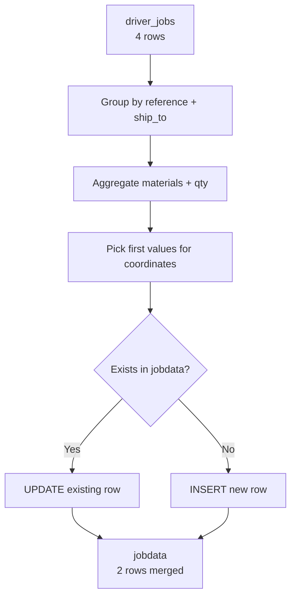

xiy# 🔄 Merge Driver Jobs to JobData - Complete Solution

## 📝 สรุป

โซลูชันนี้จะช่วยบันทึกข้อมูลจาก `driver_jobs` มาที่ `jobdata` โดย:

✅ **รวมจุดที่ซ้ำกัน** (ship_to_code เดียวกันภายใต้ reference เดียวกัน) ให้เป็น 1 แถว  
✅ **รวม materials** หลายรายการมาเป็น string (คั่นด้วย comma)  
✅ **รวม total_qty** โดยบวกจำนวนทั้งหมด  
✅ **รองรับ UPSERT** (อัพเดทถ้ามีอยู่แล้ว, insert ถ้ายังไม่มี)

---

## 📦 ไฟล์ทั้งหมด

### 1. SQL Migrations

| ไฟล์ | คำอธิบาย |
|------|----------|
| `supabase/migrations/20260117_fix_driver_jobs_allow_duplicate.sql` | แก้ไข driver_jobs ให้รองรับ reference ซ้ำได้ (1 reference = หลาย items) |
| `supabase/migrations/20260117_merge_driver_jobs_to_jobdata.sql` | สร้าง functions สำหรับรวมข้อมูล |

### 2. Test Scripts

| ไฟล์ | คำอธิบาย |
|------|----------|
| `supabase/test_merge_driver_jobs.sql` | สคริปต์ทดสอบการทำงานทั้งหมด |

### 3. Batch Scripts

| ไฟล์ | คำอธิบาย |
|------|----------|
| `sync-driver-jobs-to-jobdata.bat` | รัน sync อัตโนมัติ (Windows) |

### 4. Documentation

| ไฟล์ | คำอธิบาย |
|------|----------|
| `MERGE_DRIVER_JOBS_GUIDE.md` | คู่มือการใช้งานฉบับสมบูรณ์ |
| `README_MERGE_SOLUTION.md` | ไฟล์นี้ (สรุปโซลูชัน) |

---

## 🚀 Quick Start

### 1. Setup Database Schema

```sql
-- 1.1 ให้ driver_jobs รองรับ duplicate references
-- รันใน Supabase SQL Editor:
\i supabase/migrations/20260117_fix_driver_jobs_allow_duplicate.sql

-- 1.2 สร้าง merge functions
\i supabase/migrations/20260117_merge_driver_jobs_to_jobdata.sql
```

### 2. Test with Sample Data

```sql
-- รันทดสอบทั้งหมด (insert test data + merge + verify)
\i supabase/test_merge_driver_jobs.sql
```

### 3. Sync Production Data

```sql
-- รวมข้อมูลทั้งหมดจาก driver_jobs ไป jobdata
SELECT * FROM sync_all_driver_jobs_to_jobdata();
```

---

## 📊 ตัวอย่างการทำงาน

### Input (driver_jobs)

| reference  | shipment_item | ship_to  | material_desc     | delivery_qty |
|------------|---------------|----------|-------------------|--------------|
| 2601M01559 | 1             | 11000973 | PT MAX GASOHOL 95 | 3.00         |
| 2601M01559 | 2             | 11000973 | PT MAX DIESEL     | 8.00         |
| 2601M01559 | 3             | ZSF76    | PT MAX GASOHOL 95 | 3.00         |
| 2601M01559 | 4             | ZSF76    | PT MAX DIESEL     | 4.00         |

### Output (jobdata)

| id | reference  | seq | ship_to_code | materials                          | total_qty |
|----|------------|-----|--------------|-------------------------------------|-----------|
| 1  | 2601M01559 | 1   | 11000973     | PT MAX DIESEL, PT MAX GASOHOL 95   | 11.00     |
| 2  | 2601M01559 | 3   | ZSF76        | PT MAX DIESEL, PT MAX GASOHOL 95   | 7.00      |

**จาก 4 แถว → เหลือ 2 แถว** (รวมจุดที่ซ้ำกัน)

---

## 🔧 SQL Functions

### 1. `merge_driver_jobs_to_jobdata(p_reference TEXT)`

รวมข้อมูลสำหรับ reference เดียว

```sql
SELECT * FROM merge_driver_jobs_to_jobdata('2601M01559');
```

**Returns:**
```
inserted_count | merged_count | message
---------------|--------------|------------------------------------------
2              | 2            | Inserted 2 new stops, merged 2 duplicate items
```

### 2. `sync_all_driver_jobs_to_jobdata()`

รวมข้อมูลทั้งหมด

```sql
SELECT * FROM sync_all_driver_jobs_to_jobdata();
```

**Returns:**
```
total_inserted | total_merged | references_processed | message
---------------|--------------|----------------------|------------------------------------------
2              | 2            | 1                    | Processed 1 references: 2 stops inserted, 2 items merged
```

---

## 🎯 Logic การรวมข้อมูล

### Group By
```sql
GROUP BY (reference, ship_to_code)
```

### Aggregate
- **materials**: `STRING_AGG(DISTINCT material_desc, ', ' ORDER BY material_desc)`
- **total_qty**: `SUM(delivery_qty)`
- **seq**: `MIN(shipment_item::INTEGER)`

### Pick First Value
- **dest_lat, dest_lng**: `(ARRAY_AGG(dest_lat ORDER BY shipment_item))[1]`
- **ship_to_address**: `(ARRAY_AGG(ship_to_address ORDER BY shipment_item))[1]`

---

## 📋 Step-by-Step Workflow



---

## ✅ Testing Checklist

- [ ] Run migration `20260117_fix_driver_jobs_allow_duplicate.sql`
- [ ] Run migration `20260117_merge_driver_jobs_to_jobdata.sql`
- [ ] Insert test data (4 rows)
- [ ] Run `merge_driver_jobs_to_jobdata('2601M01559')`
- [ ] Verify: Should create 2 rows in jobdata
- [ ] Verify: materials should be combined
- [ ] Verify: total_qty should be summed
- [ ] Run merge again: Should UPDATE, not INSERT
- [ ] Run `sync_all_driver_jobs_to_jobdata()`
- [ ] Clean up test data

---

## 🔄 Automation (Optional)

### Supabase Edge Function

สร้าง function ที่รัน sync อัตโนมัติทุกชั่วโมง:

```typescript
// supabase/functions/auto-sync-jobs/index.ts
import { serve } from "https://deno.land/std@0.168.0/http/server.ts"
import { createClient } from 'https://esm.sh/@supabase/supabase-js@2'

serve(async (req) => {
  const supabase = createClient(
    Deno.env.get('SUPABASE_URL') ?? '',
    Deno.env.get('SUPABASE_SERVICE_ROLE_KEY') ?? ''
  )

  const { data, error } = await supabase
    .rpc('sync_all_driver_jobs_to_jobdata')

  return new Response(JSON.stringify({ data, error }), {
    headers: { "Content-Type": "application/json" }
  })
})
```

### Supabase Cron Job

```sql
-- ตั้งเวลารัน sync ทุกวันเวลา 00:00
SELECT cron.schedule(
  'sync-driver-jobs-daily',
  '0 0 * * *', -- ทุกวันเวลา 00:00
  'SELECT sync_all_driver_jobs_to_jobdata()'
);
```

---

## 🐛 Troubleshooting

### ❌ Error: duplicate key value violates unique constraint "driver_jobs_reference_key"

**Solution:** รัน migration `20260117_fix_driver_jobs_allow_duplicate.sql`

### ❌ Error: function merge_driver_jobs_to_jobdata does not exist

**Solution:** รัน migration `20260117_merge_driver_jobs_to_jobdata.sql`

### ⚠️ ไม่มีข้อมูลถูกรวม (inserted_count = 0)

**Check:**
```sql
-- ตรวจสอบว่ามีข้อมูลใน driver_jobs หรือไม่
SELECT COUNT(*), reference FROM driver_jobs GROUP BY reference;

-- ตรวจสอบ ship_to มี null หรือไม่
SELECT COUNT(*) FROM driver_jobs WHERE ship_to IS NULL OR ship_to = '';
```

---

## 📚 เอกสารเพิ่มเติม

- [MERGE_DRIVER_JOBS_GUIDE.md](MERGE_DRIVER_JOBS_GUIDE.md) - คู่มือการใช้งานฉบับสมบูรณ์
- [supabase/test_merge_driver_jobs.sql](supabase/test_merge_driver_jobs.sql) - สคริปต์ทดสอบ

---

## 💡 Best Practices

1. **ทดสอบกับ reference เดียวก่อน** - ใช้ `merge_driver_jobs_to_jobdata('REF')`
2. **ตรวจสอบผลลัพธ์** - เปรียบเทียบข้อมูลก่อน-หลัง
3. **Backup ก่อน sync ครั้งแรก** - Export ข้อมูลเก่าไว้ก่อน
4. **ตั้งเวลารัน sync อัตโนมัติ** - ใช้ Supabase Cron
5. **Monitor logs** - ตรวจสอบ inserted/merged count

---

## 📞 Support

หากมีปัญหาหรือคำถาม:
1. ตรวจสอบ [MERGE_DRIVER_JOBS_GUIDE.md](MERGE_DRIVER_JOBS_GUIDE.md)
2. รัน test script: `supabase/test_merge_driver_jobs.sql`
3. ตรวจสอบ Supabase logs

---

## ✨ Summary

- ✅ รวมจุดซ้ำกันจาก 4 แถว → 2 แถว
- ✅ รวม materials: "DIESEL, GASOHOL 95"
- ✅ รวม qty: 11.00 (3+8)
- ✅ รองรับ UPSERT (ไม่ duplicate)
- ✅ มี test script ครบ
- ✅ มีเอกสารครบ

**Ready to use!** 🚀
