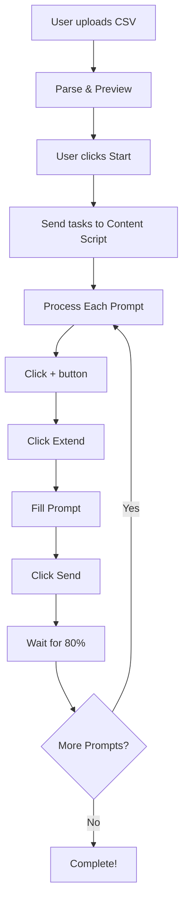

# ✅ Extend Scene Feature - Implementation Summary

## 📦 What Was Added

ฟีเจอร์ **Extend Scene** จาก Flow-Auto-2026 ได้ถูกเพิ่มเข้ามาใน **flowai-dev-copy** เรียบร้อยแล้ว!

---

## 📂 Files Created

### **Core Files** (✅ Ready to use)

| File | Purpose | Status |
|------|---------|--------|
| `js/modules/extendScene.js` | Main module - UI & logic handling | ✅ Complete |
| `content/platforms/googleFlow.js` | Content script for Google Flow automation | ✅ Complete |
| `css/extendScene.css` | Styling for Extend Scene UI | ✅ Complete |
| `html/snippets/extend-scene-section.html` | HTML template to add to sidebar | ✅ Complete |

### **Documentation Files** (📖 Guides)

| File | Purpose | Status |
|------|---------|--------|
| `EXTEND_SCENE_FEATURE.md` | Complete feature documentation | ✅ Complete |
| `EXTEND_SCENE_QUICKSTART.md` | Quick start guide | ✅ Complete |
| `examples/prompts-example.csv` | Sample CSV (English) | ✅ Complete |
| `examples/prompts-marketing-flow.csv` | Marketing flow CSV | ✅ Complete |
| `examples/prompts-thai-example.csv` | Sample CSV (Thai) | ✅ Complete |

### **Updated Files**

| File | What Changed | Status |
|------|--------------|--------|
| `manifest.json` | Added Google Flow permissions & content script | ✅ Updated |

---

## 🎯 Key Features Implemented

### 1. **CSV Upload & Preview**
- ✅ Upload CSV file with prompts (one per line)
- ✅ Auto-parse and validate
- ✅ Preview first 5 prompts with count badge
- ✅ Support both simple format and with header

### 2. **Automated Scene Extension**
- ✅ Sequential processing of all prompts
- ✅ Click (+) button automatically
- ✅ Click "Extend" option automatically
- ✅ Fill prompt automatically
- ✅ Click Send button automatically
- ✅ Wait for 80% completion before next

### 3. **Progress Tracking**
- ✅ Real-time progress bar with percentage
- ✅ Current/Total scenes counter
- ✅ Display current prompt being processed
- ✅ Smooth animations and transitions

### 4. **Controls**
- ✅ Start Extend button
- ✅ Stop button (emergency stop)
- ✅ Enable/Disable toggle
- ✅ Status messages and notifications

### 5. **Error Handling**
- ✅ Connection validation
- ✅ CSV validation
- ✅ Element detection with fallbacks
- ✅ Timeout protection
- ✅ Auto-recovery on errors

### 6. **State Management**
- ✅ Save prompts to storage
- ✅ Persist enabled state
- ✅ Restore on reload

---

## 🚀 How It Works

### **Workflow:**



### **Architecture:**

```
┌─────────────────────────────────────────┐
│           Sidebar (UI)                   │
│  ┌─────────────────────────────────┐   │
│  │  extendScene.js (Module)        │   │
│  │  - Handle UI                    │   │
│  │  - Parse CSV                    │   │
│  │  - Send tasks                   │   │
│  │  - Track progress               │   │
│  └─────────────────────────────────┘   │
└─────────────────────────────────────────┘
                ⬇ chrome.tabs.sendMessage
┌─────────────────────────────────────────┐
│      Google Flow Page (Content)         │
│  ┌─────────────────────────────────┐   │
│  │  googleFlow.js (Content Script) │   │
│  │  - Receive tasks                │   │
│  │  - Automate DOM interaction     │   │
│  │  - Wait for completion          │   │
│  │  - Report progress              │   │
│  └─────────────────────────────────┘   │
└─────────────────────────────────────────┘
```

---

## 📖 Integration Instructions

### **Step 1: Add HTML to Sidebar**

เปิดไฟล์ `html/sidebar.html`:

```html
<!-- เพิ่มใน <head> section -->
<link rel="stylesheet" href="../css/extendScene.css">

<!-- เพิ่มใน <body> (ในตำแหน่งที่เหมาะสม เช่น ในแท็บ AI Generator) -->
<!-- คัดลอกจาก html/snippets/extend-scene-section.html -->
<div id="extendSceneSection" class="section-card hidden">
    <!-- ... content from snippet ... -->
</div>

<!-- เพิ่มก่อน </body> -->
<script src="../js/modules/extendScene.js"></script>
```

### **Step 2: Show/Hide Logic** (Optional)

ถ้าต้องการแสดง/ซ่อนตามแท็บ เพิ่มใน `js/sidebar.js`:

```javascript
function updateExtendSceneVisibility() {
    const section = document.getElementById('extendSceneSection');
    if (!section) return;
    
    // แสดงเมื่ออยู่ในแท็บที่เกี่ยวข้อง
    if (currentTab === 'ai-generator' || currentTab === 'video-mode') {
        section.classList.remove('hidden');
    } else {
        section.classList.add('hidden');
    }
}

// เรียกใช้เมื่อเปลี่ยนแท็บ
function switchTab(tabName) {
    // ... existing code ...
    updateExtendSceneVisibility();
}
```

### **Step 3: Test**

1. โหลด extension: `chrome://extensions/` → Load unpacked
2. เปิด Google Flow: https://labs.google/fx/tools/flow
3. สร้างโปรเจกต์ และเข้าไป SceneBuilder
4. เปิด Extension sidebar
5. Enable Extend Scene Mode
6. Upload CSV (ใช้ไฟล์ตัวอย่างใน `examples/`)
7. Click Start Extend
8. ดูการทำงานอัตโนมัติ!

---

## 🎨 UI Components

### **Main Section:**
- ✅ Section card with icon and title
- ✅ Toggle checkbox to enable/disable
- ✅ Help text explaining feature

### **CSV Upload:**
- ✅ File input with accept=".csv"
- ✅ Status text (color-coded)
- ✅ Preview area with prompts list
- ✅ Badge showing prompt count

### **Controls:**
- ✅ Start button (primary blue)
- ✅ Stop button (danger red)
- ✅ Proper disabled states

### **Progress:**
- ✅ Header with text and percentage
- ✅ Animated progress bar
- ✅ Current scene display
- ✅ Smooth transitions

---

## ⚙️ Configuration Options

### **Wait for Completion Percentage**

Default: 80%

```javascript
// ใน js/modules/extendScene.js, line ~220
waitForPercent: 80  // เปลี่ยนเป็น 90, 95, etc.
```

### **Delay Between Tasks**

Default: 3000ms (3 seconds)

```javascript
// ใน js/modules/extendScene.js, line ~221
delayBetweenTasks: 3000  // เปลี่ยนเป็น 5000, 10000, etc.
```

### **Timeout (Max Wait)**

Default: 600 seconds (10 minutes)

```javascript
// ใน content/platforms/googleFlow.js, line ~178
const maxAttempts = 600;  // 600 seconds = 10 minutes
```

---

## 🎯 CSV Format Examples

### **Simple (Recommended):**
```csv
First scene prompt here
Second scene prompt here
Third scene prompt here
```

### **With Header:**
```csv
prompt
First scene prompt here
Second scene prompt here
```

### **Advanced (Only first column used):**
```csv
prompt,notes,category
Scene 1 prompt,Opening hook,intro
Scene 2 prompt,Product demo,main
```

---

## 🐛 Common Issues & Solutions

### **Issue 1: Extension not connecting**
**Solution:**
- Reload Google Flow page
- Reload extension
- Check URL matches `https://labs.google/fx/tools/flow*`

### **Issue 2: Extend button not found**
**Solution:**
- Make sure you're in SceneBuilder mode
- Click (+) button manually once first
- Wait 2-3 seconds then try again

### **Issue 3: Progress stuck**
**Solution:**
- Check browser console (F12) for errors
- Verify prompt was filled
- Check if Send button was clicked
- Increase timeout setting

### **Issue 4: CSV not loading**
**Solution:**
- Check file encoding is UTF-8
- Remove empty lines
- Verify one prompt per line

---

## 📊 Performance Tips

### **For Best Results:**

1. ✅ **Use clear, specific prompts**
   - Good: "Professional product showcase with dramatic lighting"
   - Bad: "Nice video"

2. ✅ **Keep prompts moderate length**
   - Recommended: 50-150 characters
   - Avoid: Single words or very long paragraphs

3. ✅ **Batch size recommendations**
   - Start small: 3-5 prompts for testing
   - Production: 10-20 prompts per batch
   - Max: 50 prompts (takes ~2-3 hours)

4. ✅ **Monitor system resources**
   - Google Flow is resource-intensive
   - Close other tabs if slow
   - Ensure stable internet connection

---

## 🔮 Future Enhancements

แนวคิดสำหรับพัฒนาต่อ:

- [ ] **Prompt Library** - Save and reuse prompts
- [ ] **Templates** - Pre-made prompt sets
- [ ] **Analytics** - Track success rates
- [ ] **Retry Logic** - Auto-retry on failure
- [ ] **Pause/Resume** - Pause and resume later
- [ ] **Multi-Queue** - Multiple CSV queues
- [ ] **Smart Wait** - Adaptive timeout based on scene complexity
- [ ] **Notifications** - Desktop notifications on completion
- [ ] **Export Results** - Save scene metadata

---

## 📚 Documentation Links

- 📖 [EXTEND_SCENE_FEATURE.md](EXTEND_SCENE_FEATURE.md) - Complete documentation
- 🚀 [EXTEND_SCENE_QUICKSTART.md](EXTEND_SCENE_QUICKSTART.md) - Quick start guide
- 📊 [COMPARISON_AND_IMPROVEMENT_PLAN.md](../COMPARISON_AND_IMPROVEMENT_PLAN.md) - Overall comparison

---

## ✅ Testing Checklist

- [ ] Extension loads without errors
- [ ] Extend Scene section displays
- [ ] Toggle works
- [ ] CSV uploads successfully
- [ ] Prompts preview displays
- [ ] Start button enables
- [ ] Connects to Google Flow
- [ ] (+) button clicked
- [ ] Extend option clicked
- [ ] Prompt filled
- [ ] Send clicked
- [ ] Progress detected
- [ ] Next prompt starts at 80%
- [ ] All prompts complete
- [ ] Stop button works
- [ ] State persists

---

## 🎉 Ready to Use!

ฟีเจอร์พร้อมใช้งานแล้ว! เพียงแค่:

1. ✅ เพิ่ม HTML snippet ลงใน sidebar
2. ✅ โหลด extension ใหม่
3. ✅ ทดสอบกับ CSV ตัวอย่าง

**Have fun extending scenes! 🎬🚀**

---

**Created By**: GitHub Copilot  
**Date**: January 10, 2026  
**Version**: 1.0  
**Status**: ✅ Complete & Ready
